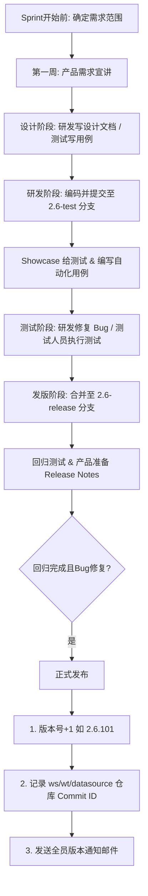
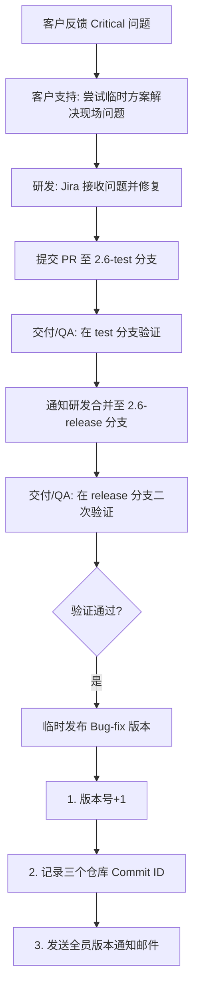
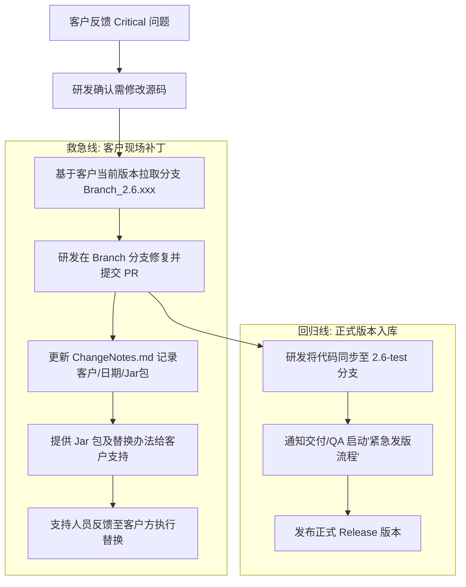
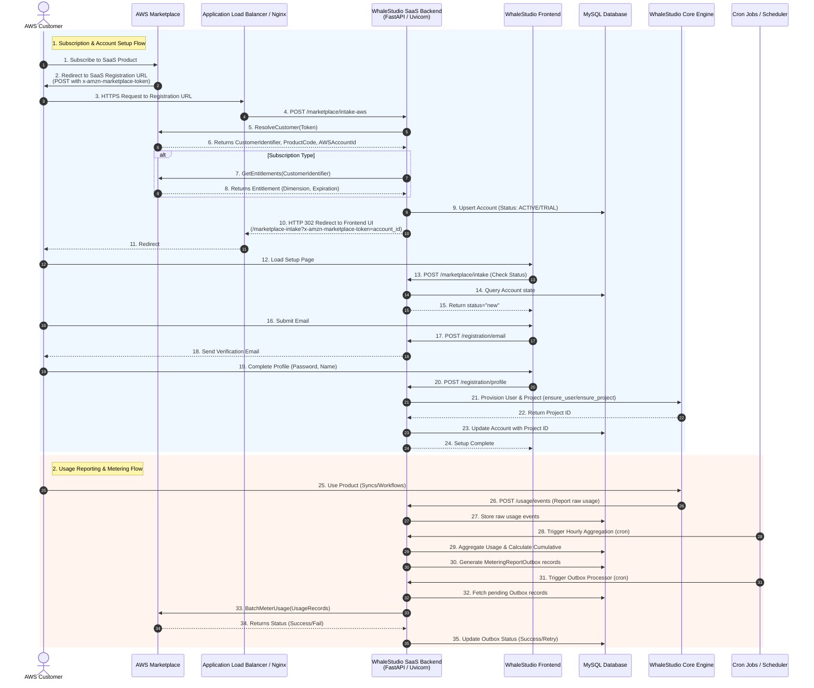

## 正常发版流程

```mermaid
graph TD
    A[Sprint开始前: 确定需求范围] --> B[第一周: 产品需求宣讲]
    B --> C[设计阶段: 研发写设计文档 / 测试写用例]
    C --> D[研发阶段: 编码并提交至 2.6-test 分支]
    D --> E[Showcase 给测试 & 编写自动化用例]
    E --> F[测试阶段: 研发修复 Bug / 测试人员执行测试]
    F --> G[发版阶段: 合并至 2.6-release 分支]
    G --> H[回归测试 & 产品准备 Release Notes]
    H --> I{回归完成且Bug修复?}
    I -- 是 --> J[正式发布]
    J --> K[1. 版本号+1 如 2.6.101]
    K --> L[2. 记录 ws/wt/datasource 仓库 Commit ID]
    L --> M[3. 发送全员版本通知邮件]
```

## 紧急发版流程 

```mermaid
graph TD
    A[客户反馈 Critical 问题] --> B[客户支持: 尝试临时方案解决现场问题]
    B --> C[研发: Jira 接收问题并修复]
    C --> D[提交 PR 至 2.6-test 分支]
    D --> E[交付/QA: 在 test 分支验证]
    E --> F[通知研发合并至 2.6-release 分支]
    F --> G[交付/QA: 在 release 分支二次验证]
    G --> H{验证通过?}
    H -- 是 --> I[临时发布 Bug-fix 版本]
    I --> J[1. 版本号+1]
    J --> K[2. 记录三个仓库 Commit ID]
    K --> L[3. 发送全员版本通知邮件]
```

## 临时紧急发版流程 

```mermaid
graph TD
    A[客户反馈 Critical 问题] --> B[研发确认需修改源码]
    B --> C[基于客户当前版本拉取分支 Branch_2.6.xxx]
    
    subgraph 救急线: 客户现场补丁
    C --> D[研发在 Branch 分支修复并提交 PR]
    D --> E[更新 ChangeNotes.md 记录客户/日期/Jar包]
    E --> F[提供 Jar 包及替换办法给客户支持]
    F --> G[支持人员反馈至客户方执行替换]
    end
    
    subgraph 回归线: 正式版本入库
    D --> H[研发将代码同步至 2.6-test 分支]
    H --> I[通知交付/QA 启动'紧急发版流程']
    I --> J[发布正式 Release 版本]
    end
```
##  AWS Architecture 

```mermaid
sequenceDiagram
    autonumber
    
    %% Actors and Components
    actor Customer as AWS Customer
    participant AWS as AWS Marketplace
    participant Nginx as Application Load Balancer / Nginx
    participant SaaS_API as WhaleStudio SaaS Backend<br/>(FastAPI / Uvicorn)
    participant UI as WhaleStudio Frontend
    participant DB as MySQL Database
    participant WhaleStudio as WhaleStudio Core Engine
    participant Cron as Cron Jobs / Scheduler
    
    %% Flow 1: Subscription and Registration
    rect rgb(240, 248, 255)
        note right of Customer: 1. Subscription & Account Setup Flow
        Customer->>AWS: 1. Subscribe to SaaS Product
        AWS->>Customer: 2. Redirect to SaaS Registration URL<br/>(POST with x-amzn-marketplace-token)
        Customer->>Nginx: 3. HTTPS Request to Registration URL
        Nginx->>SaaS_API: 4. POST /marketplace/intake-aws
        
        SaaS_API->>AWS: 5. ResolveCustomer(Token)
        AWS-->>SaaS_API: 6. Returns CustomerIdentifier, ProductCode, AWSAccountId
        
        alt Subscription Type
            SaaS_API->>AWS: 7. GetEntitlements(CustomerIdentifier)
            AWS-->>SaaS_API: 8. Returns Entitlement (Dimension, Expiration)
        end
        
        SaaS_API->>DB: 9. Upsert Account (Status: ACTIVE/TRIAL)
        SaaS_API-->>Nginx: 10. HTTP 302 Redirect to Frontend UI<br/>(/marketplace-intake?x-amzn-marketplace-token=account_id)
        Nginx-->>Customer: 11. Redirect
        
        Customer->>UI: 12. Load Setup Page
        UI->>SaaS_API: 13. POST /marketplace/intake (Check Status)
        SaaS_API->>DB: 14. Query Account state
        SaaS_API-->>UI: 15. Return status="new"
        
        Customer->>UI: 16. Submit Email
        UI->>SaaS_API: 17. POST /registration/email
        SaaS_API-->>Customer: 18. Send Verification Email
        
        Customer->>UI: 19. Complete Profile (Password, Name)
        UI->>SaaS_API: 20. POST /registration/profile
        SaaS_API->>WhaleStudio: 21. Provision User & Project (ensure_user/ensure_project)
        WhaleStudio-->>SaaS_API: 22. Return Project ID
        SaaS_API->>DB: 23. Update Account with Project ID
        SaaS_API-->>UI: 24. Setup Complete
    end
    
    %% Flow 2: Usage Metering and Billing
    rect rgb(255, 245, 238)
        note right of Customer: 2. Usage Reporting & Metering Flow
        Customer->>WhaleStudio: 25. Use Product (Syncs/Workflows)
        WhaleStudio->>SaaS_API: 26. POST /usage/events (Report raw usage)
        SaaS_API->>DB: 27. Store raw usage events
        
        Cron->>SaaS_API: 28. Trigger Hourly Aggregation (cron)
        SaaS_API->>DB: 29. Aggregate Usage & Calculate Cumulative
        SaaS_API->>DB: 30. Generate MeteringReportOutbox records
        
        Cron->>SaaS_API: 31. Trigger Outbox Processor (cron)
        SaaS_API->>DB: 32. Fetch pending Outbox records
        SaaS_API->>AWS: 33. BatchMeterUsage(UsageRecords)
        AWS-->>SaaS_API: 34. Returns Status (Success/Fail)
        SaaS_API->>DB: 35. Update Outbox Status (Success/Retry)
    end
```
